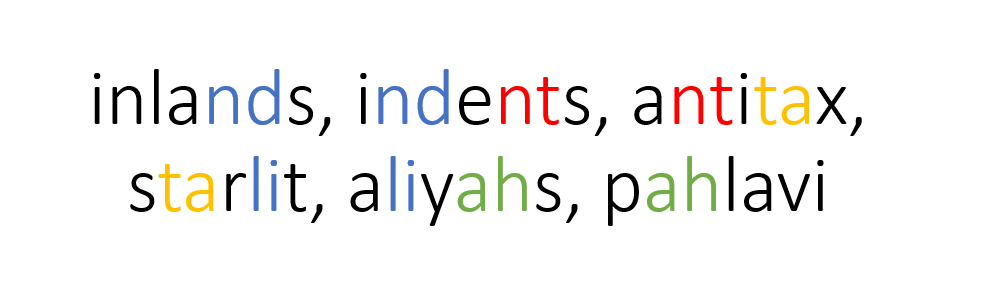

# linkedWords
An algorithm to find the longest sequence of words that are the same length from a dictionary. The 2nd and 3rd last letters are matched with 2nd and 3rd letters of another word to continue the sequence. 

The dictionary file included contains 127, 142 words, with a bell curve distribution centered at words of length 8. And it ranges from words of 4 letters to 15.
